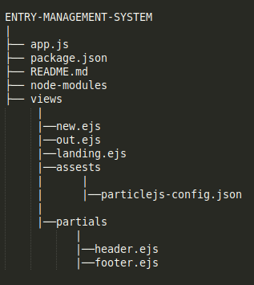
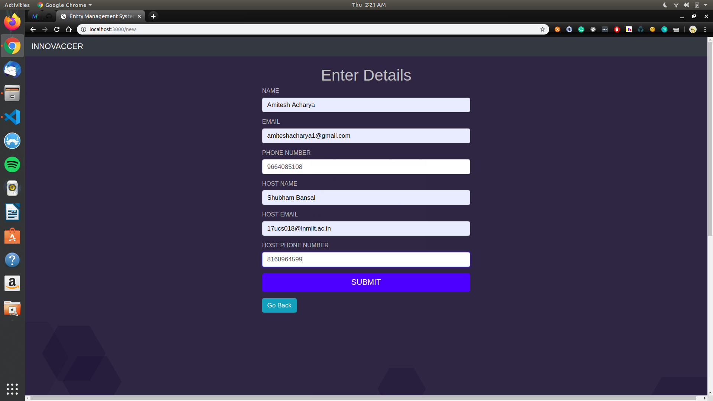
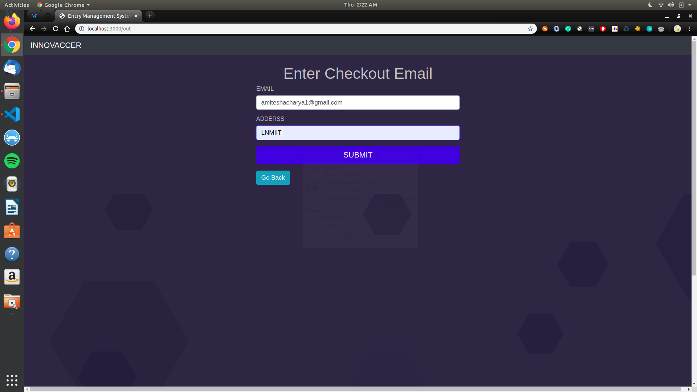

# Entry Management System

## Assignment for SDE-Intern at Innovaccer

### Prerequisites
-   Nodejs v8.10.0
-   NPM Packages
-   HTML5, CSS3, Javascript
-   A Gmail Account
-   Fast2sms API and Secret Key

## Technology Stack

#### Frontend
-   HTML5
-   CSS3
-   Javascript
-   Bootstrap v4.3.1
-   jQuery

#### Backend
-   Nodejs v8.10.0
-   Express
-   npm Packages

#### Database
-   MongoDB ( Non- Relational Database )

## Why Nodejs
-   Node.js is an open-source, cross-platform, JavaScript runtime environment that executes JavaScript code outside of a browser.
-   Node. js is primarily used for non-blocking, event-driven servers, due to its single-threaded nature. It's used for traditional web sites and back-end API services, but was designed with real-time, push-based architectures in mind.

## Why MongoDB
-   MongoDB is used to implement a data store that provides high performance, high availability, and automatic scaling. It is extremely simple to install and implement. MongoDB uses JSON or BSON documents to store data.

## Folder Structure


# Approach
-   First, when the landing page of the website renders, the user has the choice to checkin or checkout.

## Checkin:-
-   When the user clicks on the check-in button the server redirects the user to the check-in form, the user enters his name, email, phone no., host's name, host's email and host's phone no. and clicks on the submit button. The form data is sent to the backend using  'body-parser' package and stored in local variables, then using 'mongoose' a schema is created then the data in the local variables are stored to the database with the data timestamp is also stored as check-in time and the user is checked-in, an sms and an email is sent to host informing about the same. After each check-in, the user is redirected to the landing page of the website.

## Checkout:-
-   When the user clicks on the check-out button the server redirects the user to the check-out form then the user enters his email address and host's address and clicks on submit then the form data and the checkout timestamp are send back to local variables updating the database and an email is sent to the user confirming the checkout.

## Checkin Demo

> Checkin form page

## Checkout Demo

> Checkout form page

## Dependencies
```bash
 express
 body-parser
 mongoose
 nodemailer
 unirest
 ejs
 email-validator
 validate-phone-number-node-js
```

## Constraints
1.  A user can't checkin if he/she has  not checked out after a visit.
2.  Multiple checkout is not possible for a single user in a row.
3.  User can't submit Checkin/Checkout forms till all the fields are filled and are valid.

## Installation
1.  Create a folder 'Innovaccer' in your home directory ` mkdir Innovaccer `
2.  Copy the content of the zip to the folder.
3.  Enter the folder: ` cd Innovaccer `
4.  Install dependencies: ` npm install `
5.  Start your MongoDB Server ` sudo service mongod start `
6.  Start application: ` node app.js `
7.  Visit [http://localhost:3000]("http://localhost:3000") to view the application.


